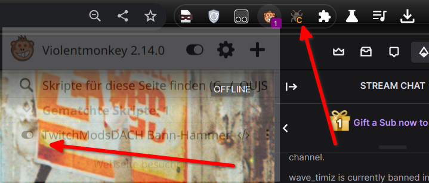
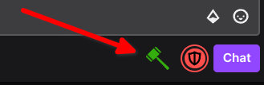
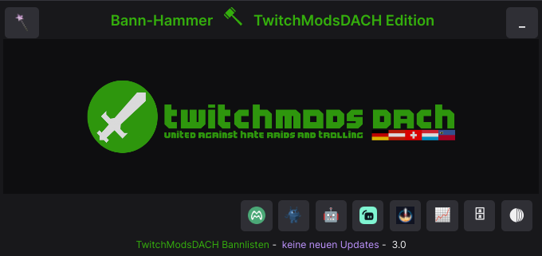
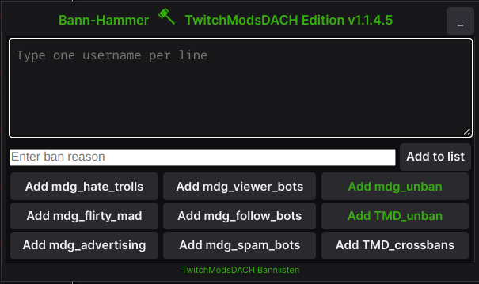
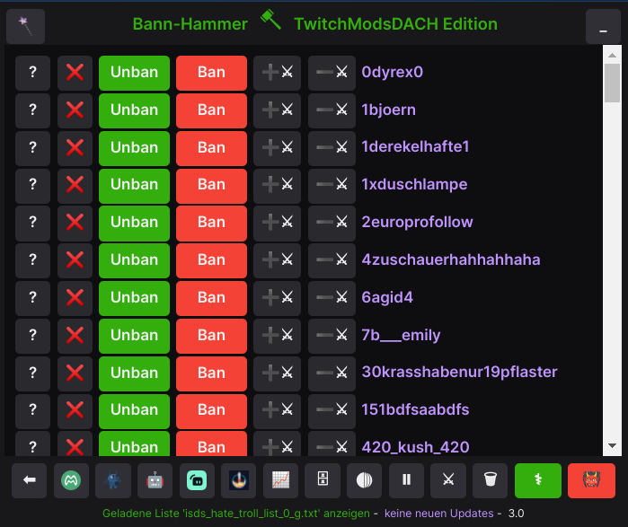

# TwitchModsDACH Bann-Hammer
Der **TwitchModsDACH Bann-Hammer** ist ein Fork von [RaidHammer](https://github.com/victornpb/twitch-mass-ban).
Ein sehr nützliches Tool für Moderatoren die in mehreren Kanälen massenhaft Leute zu bannen haben.

Da uns manche Funktionen nicht genutzt oder schlecht implementiert sind und andere wiederum gefehlt haben,
wurde für die Community eine eigene Version des [RaidHammer](https://github.com/victornpb/twitch-mass-ban) erstellt.

Diese Version ermöglicht es, zusätzliche zu eigenen Listen, unsere [Bannlisten](https://github.com/TwitchmodsDACH/Bannlisten) zu importieren und direkt zu bannen. 
Weiter wurde ein unban-Funktion eingebaut, welche ebenfalls zusätzlich zu eigenen Listen mit der von uns bereitgestellten Enbann-Liste genutzt werden kann.
ZU guterletzt gibt es noch die Möglichkeit einen Bann-Grund anzugeben.

## Status der Code-Übernahme
- TwitchModsDACH Bannlisten integriert
- Unban Funktion hinzugefüht
- Bann-Grund Funktion hinzugefügt
- erste unnütze Code-Schnippsel entfernt
- Follower Überwachung ist schlecht implementiert und wird aktuell nicht genutzt
- Um das CORS Problem zu entgehen ist aktuell noch ein weiteres Plugin nötig

## Hinweis zu CORS
CORS (Cross-Origin Resource Sharing) ist ein Mechanismus, der die Sicherheit von Websites durch die Kontrolle von Cross-Origin-Requests verbessert. Es erlaubt Websites, Ressourcen von anderen Domains zu laden, jedoch nur unter bestimmten Bedingungen, um Angriffe durch böswillige Skripte zu verhindern. CORS wird von Webbrowsern implementiert, um sicherzustellen, dass die Anfragen von anderen Domains nur dann ausgeführt werden, wenn sie von der angeforderten Domain explizit genehmigt wurden.

Also eigentlich richtig und wichtig. Für den Anwendungsfall Bannlisten von anderen Webseiten automatisch einlesen zu können ist das aber hinderlich, denn es macht es unmöglich.

Da die Erweiterung selbst noch nicht dazu in der Lage ist, muss hier der Umweg über eine Erweiterung genommen werden, um es für die Nutzung auszuschalten.

**__UNBEDINGT NACH DER NUTZUNG CORS LOCK WIEDER EINSCHALTEN ÜBER DIE ERWEITERUNG CORS UNLOCK - EINFACH AUF DAS ICON KLICKEN (DAS C WIRD DABEI GRAU UND IST NICHT MEHR ORANGE)__**

## Voraussetzungen
- Eine Möglichkeit im Browser JavaScript auszuführen
	Chrome: [Violentmonkey](https://chrome.google.com/webstore/detail/violent-monkey/jinjaccalgkegednnccohejagnlnfdag) or [Tampermonkey](https://chrome.google.com/webstore/detail/dhdgffkkebhmkfjojejmpbldmpobfkfo)
	Firefox: [Greasemonkey](https://addons.mozilla.org/en-US/firefox/addon/greasemonkey/), [Tampermonkey](https://addons.mozilla.org/en-US/firefox/addon/tampermonkey/), or [Violentmonkey](https://addons.mozilla.org/firefox/addon/violentmonkey/)
	Edge: [Tempermonkey](https://microsoftedge.microsoft.com/addons/detail/iikmkjmpaadaobahmlepeloendndfphd) or [Violentmonkey](https://microsoftedge.microsoft.com/addons/detail/eeagobfjdenkkddmbclomhiblgggliao)
	Safari: [Tempermonkey](https://apps.apple.com/us/app/tampermonkey/id1482490089)
	Opera: [Termpermonkey](https://addons.opera.com/en/extensions/details/tampermonkey-beta/)

- Die Erweiterung im Browser die CORS abschaltet
	- Auf Chrome basierte Browser [CORS Unlock](https://chrome.google.com/webstore/detail/cors-unblock/lfhmikememgdcahcdlaciloancbhjino)
	- Auf Firefox basierte Browser [CORS Unlock](https://addons.mozilla.org/de/firefox/addon/cors-unblock/)

## Installation
Sobald beide Browser Erweiterungen installiert sind und CORS Unlock aktiv ist,
kann man in Termper-/Grease-/ViolentMonkey ein neues User Script hinzufügen.

Dazu in den sich öffnenden Editor den Inhalt der Datei [tmbbannhammer.user.js](tmbbannhammer.user.js) kopieren und speichern.



Sobald nun eine Twitch Seite besucht wird (ggf. offene Tabs neuladen) wird in einem Kanal in dem ihr Moderator seid unter dem Chat ein kleiner BannHammer angezeigt:

1. Durch anklicken öffnet sich der BannHammer



2. Anklicken des Logos



3. Liste einfügen oder auswählen



4. Bannen/Entbannen



## Hinweise zur Benutzung

**WICHTIG**: Es darf nur einen Twitch Tab im Browser-Fenster geben, sobald ein weiteren Tab dazukommt, versucht der Bannhammer dort zu bannen.

**HINWEIS**: Bei einigen kommt es je nach Einstellungen mit Erweiterungen wie Frankers/BetterTTV/7TVAPP zu Problem.
Hier ggf. für das Bannen diese Erweiterungen deaktivieren, wenn man Probleme hat.

**PRO TIPP**: Man kann das Tool minimieren, sobald es anfängt zu bannen, es bannt dann weiter und kann durch erneutes klicken auf den BannHammer unter dem Chat wieder geöffnet werden.

### Postion des BannHammer Menü
Wem die Position des Menüs nicht gefällt, diese kann im Code angepasst werden

```
        .raidhammer {
            position: fixed;
            bottom: 10px;
            right: 800px;      <<< je kleiner, umso näher am Mod-Schwert unter dem Chat
            z-index: 99999999;
            background-color: var(--color-background-base);
            color: var(--color-text-base);
            border: var(--border-width-default) solid var(--color-border-base);
            box-shadow: var(--shadow-elevation-2);
            padding: 5px;
            min-width: 500px;
      }
```

## Support
Unsere Mitglieder sind herzlich eingeladen im Discord ein Ticket im Kanal tmd-support zu öffnen.
