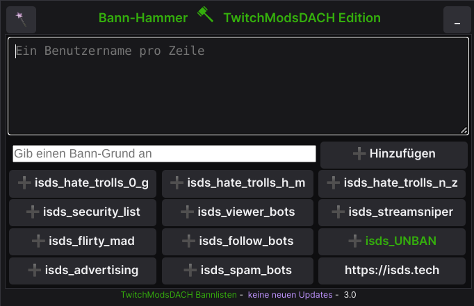

# TwitchModsDACH Bann-Hammer

Der **TwitchModsDACH Bann-Hammer** ist ein Fork von [RaidHammer](https://github.com/victornpb/twitch-mass-ban).
Ein sehr nützliches Tool für Moderatoren die in mehreren Kanälen massenhaft Leute zu bannen haben.

Da uns manche Funktionen des [RaidHammer](https://github.com/victornpb/twitch-mass-ban) nicht genutzt haben oder schlecht implementiert waren und andere Funktionen wiederum gefehlten, wurde für die Community eine eigene Version des [RaidHammer](https://github.com/victornpb/twitch-mass-ban) erstellt.

Unseren Mitglieder soll damit eine einfache Möglichkeit an die Hand geben werden, auf einfache Weise & feingranular zu bestimmen, welche Liste gebannt oder entbannt werden soll.

## Disclaimer
Grundsätzlich ist mit Tools wie Tempermonkey und eigenen Users-Scripts vorsicht geboten. Denn mittels dieser Erweiterungen ist potentiell möglich, eure Session von Youtube Twitch oder was auch immer abzugreifen.
Daher ist uns hier die Transparenz sehr wichtig.

Es wurde sich ganz bewusst dagegen entschieden, satt das Senden von Chat-Nachrichten direkt gegen die API von Twitch zu gehen.
Denn dazu müsset das Tool sich eben dann euren Token ausleihen für die Authentifizierung gegen die API.
Und damit hier erst gar keine Vermutungen aufkommen, wurde einfach darauf verzichtet und an der Art,
wie auch schon der Raidhammer funktioniert hat nichts geändert.

Der Code kann aktuell nur von 2 Menschen hier im Repo verändert werden, weiter habt ihr bei der Updatet-Funktion immer die Möglichkeit direkt den Code zu sehen, der nachgeladen werden soll **BEVOR** ihr das Update durchführt.

Wir hoffen damit die nötige Transparenz und Vertrauen in das Tool zuschaffen.

## Funktionsweise des Bann-Hammer
- Es wird ein Speicher mit localStorage eures Browsers abgelegt.
  - kanalname_banlist (Pro Kanal wird ein Speicher angelegt)
  - kanalname_unbanlist (Pro Kanal wird ein Speicher angelegt)
  - Dort werden nur die User gespeichert die gebannt/entbannt wurden in einem Kanal
  - Wird ein User entbannt wird er, wenn vorhanden, aus der jeweiligen kanalname_banlist entfernt.
- Es können die Listen von [TwitchModsDach Bannlisten](https://github.com/TwitchmodsDACH/Bannlisten) abgerufen werden. Dabei wird das localStorage eines Kanals abgeglichen und nur die User geladen, die noch nicht gebannt/entbannt wurden.
- Es können auch eigene Liste mittels Copy&Paste eingefügt werden. 
  - hierbei erfolgt keine Überprüfung, ob User die Ihr in das Tool kopiert bereits gebannt wurden.
  - Dadurch kann man auch überprüfen, ob eine Bannliste wirklich auch gebannt hat, wenn man die Liste noch einmal per Copy&Paste einfügt und durchlaufen lässt.

### Nachteile des Designs
- Keine synchronisierten zwischen den Moderatoren eines Kanals.
  - Im schlimmsten Fall lassen einmal alle Moderatoren eines Kanals die Listen durchlaufen. Das ist nicht dramatisch nur initial etwas lästig.
- Löscht euer Browser beim Beenden den localStorage, werden auch die Listen gelöscht.
  - Das Problem hat man auch beim Gerätewechsel oder bei einer Neuinstallation

__In diese Nachteile wird keine Arbeit investiert, da das Tool irgendwann durch einen vernünftigen Twitch-Bot ersetzt werden soll, mit ihr dann gar keine Arbeit mehr habt__

## Wesentliche Veränderungen zu [RaidHammer](https://github.com/victornpb/twitch-mass-ban)

- CORS-Funktion eingebaut, um auf das Repository [TwitchModsDach Bannlisten](https://github.com/TwitchmodsDACH/Bannlisten) zugreifen zu können
- [TwitchModsDach Bannlisten](https://github.com/TwitchmodsDACH/Bannlisten) Synchronisation integriert
- Unban-Funktion hinzugefügt
- BannGrund-Funktion hinzugefügt
- Update-Funktion hinzugefügt
- Re-Design durchgeführt
- Prinzessinnen Modus hinzugefügt
- Nützliche Moderator Tools hinzugefügt
- Pause-Funktion hinzugefügt
- LocalStorage integriert
- Die Funktion das Follower automatisch auch im Banntool angezeigt werden wurde ausgebaut
  - Sie funktionierte im [RaidHammer](https://github.com/victornpb/twitch-mass-ban) über die Mechanik, das Streamlabs oder Streamelemnts einen ganz bestimmten Satz sagen mussten, damit das erkannt wird. Follower löschen kann man mit [ComanderRoot](https://twitch-tools.rootonline.de/).

## Funktioniert ***nicht*** mit ...

- Safari

## Voraussetzungen
Eine der folgenden Erweiterungen wird benötigt.

- Chrome: [Violentmonkey](https://chrome.google.com/webstore/detail/violent-monkey/jinjaccalgkegednnccohejagnlnfdag) or [Tampermonkey](https://chrome.google.com/webstore/detail/dhdgffkkebhmkfjojejmpbldmpobfkfo)
- Firefox: [Greasemonkey](https://addons.mozilla.org/en-US/firefox/addon/greasemonkey/), [Tampermonkey](https://addons.mozilla.org/en-US/firefox/addon/tampermonkey/), or [Violentmonkey](https://addons.mozilla.org/firefox/addon/violentmonkey/)
- Edge: [Tampermonkey](https://microsoftedge.microsoft.com/addons/detail/iikmkjmpaadaobahmlepeloendndfphd) or [Violentmonkey](https://microsoftedge.microsoft.com/addons/detail/eeagobfjdenkkddmbclomhiblgggliao)
- Safari: [Tampermonkey](https://apps.apple.com/us/app/tampermonkey/id1482490089)
- Opera: [Tarmpermonkey](https://addons.opera.com/en/extensions/details/tampermonkey-beta/)

## Installation

Wenn Termper-/Grease-/ViolentMonkey installiert ist, einfach diesen Link anklicken --> [bannhammer.user.js](https://github.com/TwitchmodsDACH/Bann-Hammer/raw/main/bannhammer.user.js)
Es öffnet sich euer Monkey und man kann das User-Script mit einem Klick instalieren.

Wenn alles richtig durchgeführt ist, sollte es aussehen (das Logo kann variieren je nach ....Monkey).


Wir eine Twitch Seite besucht (ggf. offene Tabs neuladen), wird in einem Kanal in dem man Moderator unter dem Chat ein kleiner grüner BannHammer angezeigt:

1. Durch anklicken öffnet sich der BannHammer


2. Anklicken des TwitchModsDACH Logo in der Mitte


3. Liste einfügen oder auswählen



4. Bannen/Entbannen


## Hinweise zur Benutzung

**WICHTIG**: Es darf nur einen Twitch Tab im Browser-Fenster geben, sobald ein weiteren Tab dazukommt, versucht der Bannhammer dort zu bannen.

‼ Das Tool arbeitet mit eurem Chatfenster. Klickt ihre da rein oder schreibet etwas, dann bringt ihr das Tool aus dem tritt. Das Tool ist nicht dafür gedacht, während der normladen Nutzung mit Tonnen von User betankt zu werden. Möchte man das machen ist die Empfehlung: _**eigenes Browserfenster in dem nur der Kanal offen ist in dem gebannt werden soll und sonst nichts.**_

‼: _**Nicht mehrere Kanäle gleichzeitig bannen!**_ Hintergrund: **Shadowban-Gefahr**, da zu viele Anfragen in zu kurzer Zeit bei Twitch aufschlagen. Das mag Twitch nicht!

⁉ Bei einigen kommt es je nach Einstellungen mit Erweiterungen wie Frankers/BetterTTV/7TVAPP zu Problem.
Hier ggf. für das Bannen diese Erweiterungen deaktivieren, wenn man Probleme hat.

### Die Sache mit "Merken wo welcher User gebannt wurde
Das Tool verwendet dazu den LocalStorage des Browsers.

Das bedeutet: 
- man benutzt mehrere Browser? 
  - Der Speicher ist pro Browser. __Browser übergreifend funktioniert das also nicht!__
- Im LocalStorage gespeichert Listen löschen
  - Entwicklungs-Konsole des Browser öffnen
  - den Tab Application/Anwendung suchen
  - Dort LocalStorage auswählen
  - dann nach "\_bannlist" filtern
  - die gefunden Einträge mit Rechts-Klick löschen

***Werden Coockies und das LocalStorage gelöscht, müssen alle Listen noch einmal gebannt werden!***

### Postion des BannHammer Menü verändern
Wem die Position des Menüs nicht gefällt, kann die Position im Code angepasst werden:

```
        .raidhammer {
            position: fixed;
            bottom: 10px;
            right: 800px;      <<< je kleiner, umso näher am Mod-Schwert unter dem Chat
            z-index: 99999999;
            background-color: var(--color-background-base);
            color: var(--color-text-base);
            border: var(--border-width-default) solid var(--color-border-base);
            box-shadow: var(--shadow-elevation-2);
            padding: 5px;
            min-width: 500px;
      }
```

### Das Tool läuft eine Weile, dann kommt ein Fehler auf der Website von Twitch
Dann ist vermutlich für euer Setup die Geschwindigkeit zu hoch für die MassenBann/MassenUnbann funktionen.
Das könnt ihr an diesen beiden Stellen anpassen:
**HINWEIS:** Es ist dringend davon abzuraten den Wert runter zu setzen -> Twitch Shadow-Ban Gefahr!!!

```
    async function banAll() {
      console.log(LOGPREFIX, 'Banning all...', queueList);
      for (const user of queueList) {
          banItem(user);
          await delay(125); <<<<<< Hier in kleinen 10er Schritter bis 200 gehen
      }
    }

    async function unbanAll() {
      console.log(LOGPREFIX, 'Banning all...', queueList);
      for (const user of queueList) {
          unbanItem(user);
          await delay(125); <<<<<< Hier in kleinen 10er Schritter bis 200 gehen
      }
    }
```

### Für unsere Prinzessinnen
Auf vielfachen Wunsch einer Person wurde ein Prinzessinen Modus eingebaut. Wer Glitzer will muss sich das vorher gut überlegen, denn auch wenn die Farbe sich wieder ändert **der Glitzerfunkel bleibt**. Getreu dem Motto "__Einmal Prinzessin immer Prinzessin__" :P

## Support
Ihr könnt gern [hier](https://github.com/TwitchmodsDACH/Bann-Hammer/issues) ein Ticket aufmachen.
Unsere Mitglieder können auch sehr gern auf unserem Community Discord ein Ticket erstellen.
