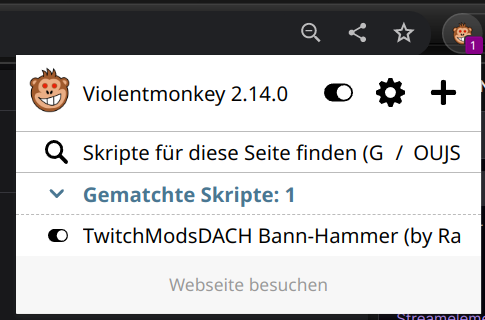

# TwitchModsDACH Bann-Hammer

Der **TwitchModsDACH Bann-Hammer** ist ein Fork von [RaidHammer](https://github.com/victornpb/twitch-mass-ban).
Ein sehr nützliches Tool für Moderatoren die in mehreren Kanälen massenhaft Leute zu bannen haben.

Da uns manche Funktionen nicht genutzt oder schlecht implementiert waren und andere Funktionen wiederum gefehlt haben,
wurde für die Community eine eigene Version des [RaidHammer](https://github.com/victornpb/twitch-mass-ban) erstellt.

Unseren Mitglieder soll damit eine einfache Möglichkeit an die Hand geben werden, auf einfache Weise & feingranular zu bestimmen, welche Liste gebannt oder entbannt werden soll.

## Wesentliche Veränderungen zu [RaidHammer](https://github.com/victornpb/twitch-mass-ban)

- CORS-Funktion eingebaut 
- [TwitchModsDach Bannlisten](https://github.com/TwitchmodsDACH/Bannlisten) integriert
- Unban-Funktion hinzugefügt
- BannGrund-Funktion hinzugefügt
- Update-Funktion hinzugefügt
- Re-design durchgeführt
- Prinzessinnen Wunsch hinzugefügt
- Nützliche Moderator Tools hinzugefügt
- Pause-Funktion hinzugefügt
- **RICHTIG & WICHTIG** Funktion hinzugefügt mit der das Tool sich merken kann, in welchem Kanal schon welcher User damit gebannt wurde.

## Funktioniert ***nicht*** mit Safari
Aktuell funktioniert der Bannhammer noch nicht unter Safari.

## Voraussetzungen
Eine der folgenden Erweiterungen wird benötigt
- Chrome: [Violentmonkey](https://chrome.google.com/webstore/detail/violent-monkey/jinjaccalgkegednnccohejagnlnfdag) or [Tampermonkey](https://chrome.google.com/webstore/detail/dhdgffkkebhmkfjojejmpbldmpobfkfo)
- Firefox: [Greasemonkey](https://addons.mozilla.org/en-US/firefox/addon/greasemonkey/), [Tampermonkey](https://addons.mozilla.org/en-US/firefox/addon/tampermonkey/), or [Violentmonkey](https://addons.mozilla.org/firefox/addon/violentmonkey/)
- Edge: [Tampermonkey](https://microsoftedge.microsoft.com/addons/detail/iikmkjmpaadaobahmlepeloendndfphd) or [Violentmonkey](https://microsoftedge.microsoft.com/addons/detail/eeagobfjdenkkddmbclomhiblgggliao)
- Safari: [Tampermonkey](https://apps.apple.com/us/app/tampermonkey/id1482490089)
- Opera: [Tarmpermonkey](https://addons.opera.com/en/extensions/details/tampermonkey-beta/)

## Installation

Wenn Termper-/Grease-/ViolentMonkey installiert ist, einfach diesen Link anklicken --> [bannhammer.user.js](https://github.com/TwitchmodsDACH/Bann-Hammer/raw/main/bannhammer.user.js)
Es öffnet sich euer Monkey und man kann das User-Script mit einem Klick instalieren.

Wenn alles richtig durchgeführt ist sollte es aussehen (das Logo kann variieren je nach ....Monkey).



Wir eine Twitch Seite besucht (ggf. offene Tabs neuladen), wird in einem Kanal in dem man Moderator unter dem Chat ein kleiner grüner BannHammer angezeigt:

1. Durch anklicken öffnet sich der BannHammer


2. Anklicken des TwitchModsDACH Logo in der Mitte


3. Liste einfügen oder auswählen


4. Bannen/Entbannen


## Hinweise zur Benutzung

**WICHTIG**: Es darf nur einen Twitch Tab im Browser-Fenster geben, sobald ein weiteren Tab dazukommt, versucht der Bannhammer dort zu bannen.

‼ Das Tool arbeitet mit eurem Chatfenster. Klickt ihre da rein oder schreibet etwas, dann bringt ihr das Tool aus dem tritt. Das Tool ist nicht dafür gedacht, während der normladen Nutzung mit Tonnen von User betankt zu werden. Möchte man das machen ist die Empfehlung: _**eigenes Browserfenster in dem nur der Kanal offen ist in dem gebannt werden soll und sonst nichts.**_

‼: _**Nicht mehrere Kanäle gleichzeitig bannen!**_ Hintergrund: **Shadowban-Gefahr**, da zu viele Anfragen in zu kurzer Zeit bei Twitch aufschlagen. Das mag Twitch nicht!

⁉ Bei einigen kommt es je nach Einstellungen mit Erweiterungen wie Frankers/BetterTTV/7TVAPP zu Problem.
Hier ggf. für das Bannen diese Erweiterungen deaktivieren, wenn man Probleme hat.

### Die Sache mit "Merken wo welcher User gebannt wurde
Das Tool verwendet dazu den LocalStorage des Browsers.
Das bedeutet: 

- benutzt du mehrere Browser? 
  - Der Speicher ist pro Browser. __Browser übrgreifend funktioniert das also nicht!__
- ***Du musst auch alle Kanäle in denen du schon gebannt hast noch einmal bannen, damit der Browser sich das auch merken kann***      
- wenn du die Buggy Version 1.1.2.x hattest, dann musst du das LocalStorage für Twitch einmal löschen.
  - Entwicklungs-Konsole des Browser öffnen
  - den Tab Application/Anwendung suchen
  - Dort LocalStorage auswählen (WICHTIG NICHT DIE COOCKIES LÖSCHEN)
    - das hat zur Folge
	- Du musst in jedem Chat einmal vorher wieder in den Chat klicken und die Chatregeln akzeptieren
        - Du musst bei jedem Kanal der ab 18 Jahren ist noch einmal bestätigen das du 18 Jahre bist
  - Das musst du auch immer machen, wenn du dein LocalStorage gelöscht/Browser zurückgesetzt/Betriebsystem neu aufgesetzt hast und kein Backup von deinem lokalen Speicher deines Browsers gemacht hast.

### Postion des BannHammer Menü verändern
Wem die Position des Menüs nicht gefällt, kann die Position im Code angepasst werden:

```
        .raidhammer {
            position: fixed;
            bottom: 10px;
            right: 800px;      <<< je kleiner, umso näher am Mod-Schwert unter dem Chat
            z-index: 99999999;
            background-color: var(--color-background-base);
            color: var(--color-text-base);
            border: var(--border-width-default) solid var(--color-border-base);
            box-shadow: var(--shadow-elevation-2);
            padding: 5px;
            min-width: 500px;
      }
```

### Das Tool läuft eine Weile, dann kommt ein Fehler auf der Website von Twitch
Dann ist vermutlich für euer Setup die Geschwindigkeit zu hoch für die MassenBann/MassenUnbann funktionen.
Das könnt ihr an diesen beiden Stellen anpassen:
**HINWEIS:** Es ist dringend davon abzuraten den Wert runter zu setzen -> Twitch Shadow-Ban Gefahr!!!

```
    async function banAll() {
      console.log(LOGPREFIX, 'Banning all...', queueList);
      for (const user of queueList) {
          banItem(user);
          await delay(125); <<<<<< Hier in kleinen 10er Schritter bis 200 gehen
      }
    }

    async function unbanAll() {
      console.log(LOGPREFIX, 'Banning all...', queueList);
      for (const user of queueList) {
          unbanItem(user);
          await delay(125); <<<<<< Hier in kleinen 10er Schritter bis 200 gehen
      }
    }
```

### Für unsere Prizessinnen
Auf vielfachen Wunsch einer Person wurde ein Prinzessinen Modus eingebaut. Wer Glitzer will muss sich das vorher überlegen, denn auch wenn die Farbe sich wieder ändert der Glitzerfunkel bleibt. Getreu dem Motto "Einmal Prinzessin immer Prinzessin" :P

## Support
Da es wohl augenscheinlich mehr Leute gibt, die das Tool benutzen, als gedacht, könnt ihr auch hier ein Issue auf GitHub aufmachen.
Unsere Mitglieder können auch sehr gern wie gehabt auf unserem Community Discord ebenfalls Tickets erstellen.
